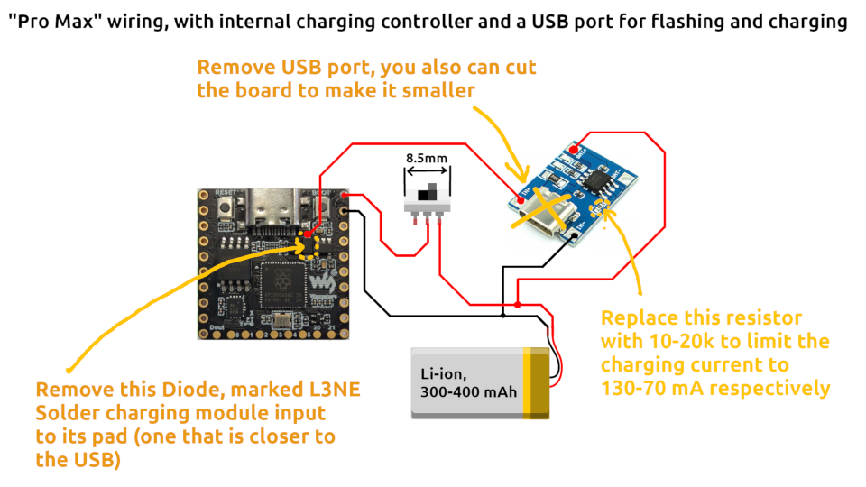
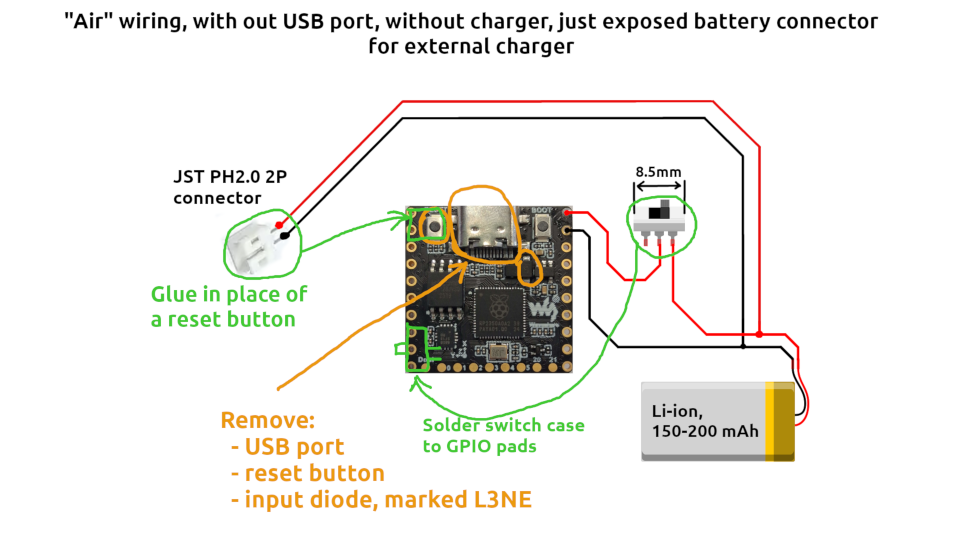

# Noco pendant

A multi face pendant for Waveshare RP2350-Matrix module

Faces included:

- Fluid simulation + standby fluid creature
- Conway's Game of Life
- 6x4 pixel pet cat
- Minecraft stills
- Flappy Bird like game (you flap the pendant to raise)
- Classic Snake game (tilt to control)
- Heart polygon collision physics sim

# Build steps

```
git clone https://github.com/poconoco/water-matrix.git ~/water-matrix
cd ~/water-matrix
git submodule update --init --recursive
mkdir build
cd build
cmake ..
make -j12
```

# Reboot RP2350 to boot mode

Either by resetting with boot button pressed, or when connected to usb, assuming board usb serial got mapped to `/dev/ttyACM0`:

```
stty -F /dev/ttyACM0 1200
```

# Flash the new firmware

Assuming Pi Pico was mounted automatically at `/media/$USER/RP2350/`:

```
cd ~/water-matrix/build
cp main.uf2 /media/$USER/RP2350/
```

Or just drag and drop using your file manager

# Quick rebuild + reflash

When you applied any changes to the source, you can use a one-line command to rebuild and flash it, should be run from the `~/water-matrix/build` workdir:

```
make -j12 && stty -F /dev/ttyACM0 1200 && sleep 5 && cp main.uf2 /media/$USER/RP2350/
```

# Case and wiring

Models to 3D print case: https://www.printables.com/model/1814784-pendant-case-for-waveshare-rp2350-matrix-module

There are two options with different size, battery capacity and wiring diagrams:

- Pro Max: Keeps the USB port for flashing and charging. Requires charging module to be added inside the case. I used simple USB charging module with removed USB port and cut off part of a board. Be sure to adjust charging current of a module to match your battery (often it requires to replace the resistor).



- Air: Removes the USB port, reset button, uses smaller battery. Adds JST PH 2 mm connector to battery to use externall charger.



# Author

Leonid / poconoco, See my YT channel https://www.youtube.com/@nocomake
Made in Ukraine
